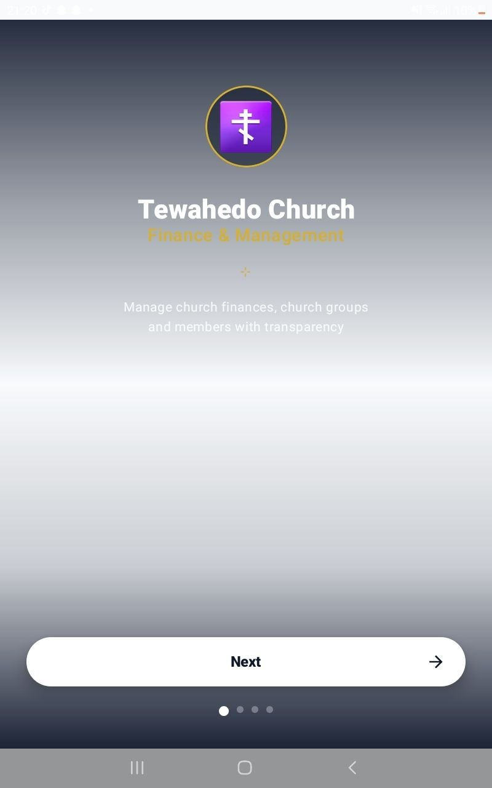
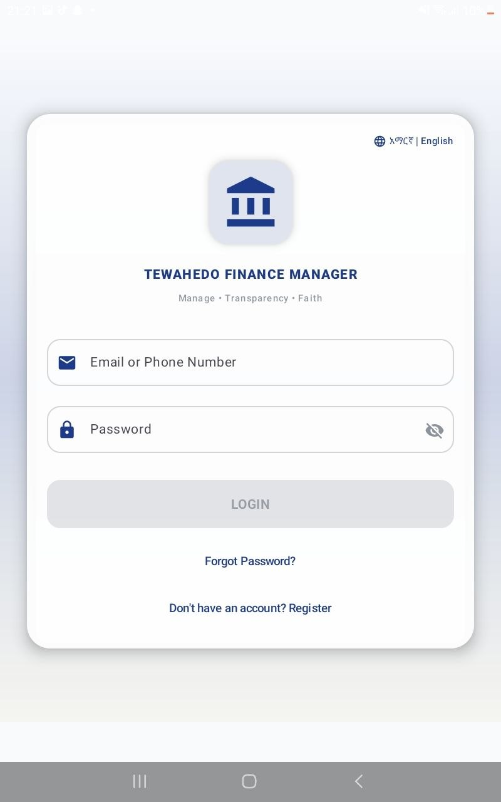
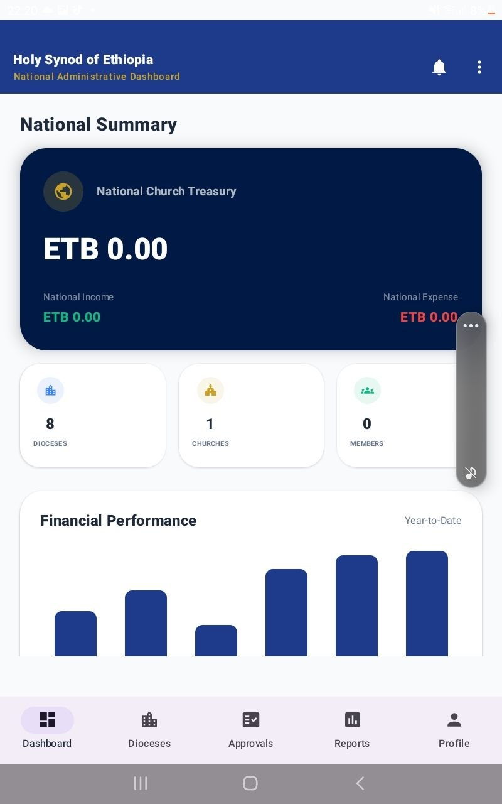

# Financial Management System for the Ethiopian Orthodox Church
## Comprehensive Ecclesiastical Administration & Transparency Platform

### ✝️ About This Project
**Tewahedo Connect** is a specialized Enterprise Resource Planning (ERP) platform designed to modernize the administrative and financial workflows of the **Ethiopian Orthodox Tewahedo Church (EOTC)**. 

As one of the world's oldest Christian institutions, the EOTC manages a vast network of dioceses, monasteries, and parishes. This project aims to bridge the gap between ancient tradition and modern efficiency by providing a secure, transparent, and audit-ready digital ecosystem.

**Mission:** To empower church administrators with tools that ensure every contribution (Tithe, donation, and gift) is managed with the highest level of integrity and transparency, ultimately supporting the church's spiritual and social missions.

**Vision:** To be the standard digital backbone for ecclesiastical management across the Ethiopian Orthodox world, fostering trust and unity through technology.

---

## 📸 Screenshots

| Splash Screen | Login Interface | National Dashboard (Synod) |
| :---: | :---: | :---: |
|  |  |  |

*(Additional screenshots available in the `image/` directory)*

---

## ✨ Key Features

- **Ecclesiastical Hierarchy**: Role-based access for Synod Admins, Diocese Bishops, Parish Priests, and Accountants.
- **Financial Transparency**: Real-time tracking of Income (Tithe, Donations) and Expenses with multi-stage approval workflows.
- **Chure Management**: Digitized traditional mutual aid groups with automated contribution tracking and payouts.
- **Personnel & Assets**: Manage clergy, employees, and sacred church assets with audit-ready logs.
- **Reporting**: Exportable financial summaries and activity logs.
- **Localization**: Full support for Amharic and English languages.

---

## 🚀 Build & Run Instructions

### Prerequisites
- **Android Studio**: Koala | 2024.1.1 or newer.
- **JDK**: Version 17.
- **Android SDK**: API Level 34 (Android 14).

### Setup
1. **Clone the Repository**:
   ```bash
   git clone https://github.com/malfiya1212/ORTHODOXAPP2.git
   ```
2. **Open in Android Studio**:
   - File -> Open -> Select the cloned folder.
   - Wait for the Gradle sync to complete.
3. **Configure Backend**:
   - The app is currently configured to connect to a local development server at `http://10.0.2.2:5000/api/` (Android Emulator loopback).
   - Ensure your backend service is running or update the `NetworkClient.kt` with your production URL.
4. **Run the App**:
   - Select an Emulator (Pixel 6 or newer recommended) or a physical device.
   - Click the **Run** button (Green Play Icon).

### Default Credentials (for testing)
- **Email**: `superadmin@church.com`
- **Password**: `Super@123`

---

## 🛠 Tech Stack
- **UI**: Jetpack Compose (Material 3)
- **Architecture**: MVVM with Repository Pattern
- **Local Database**: Room (SQLite)
- **Networking**: Retrofit 2 & OkHttp
- **Security**: SHA-256 Password Hashing & JWT Token Management
- **Image Loading**: Coil

---

## 📜 Repository Guidelines (MAD Project)
- [x] Complete project source code
- [x] Proper project structure
- [x] Working build configuration
- [x] README.md documentation
- [x] Screenshots included
- [x] Build and run instructions provided

---
© 2026 Tewahedo Connect Team. Managed with Faith & Transparency.
